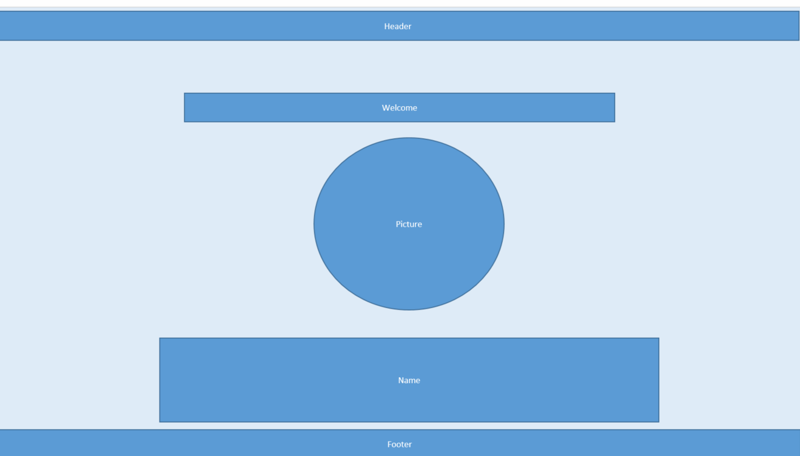
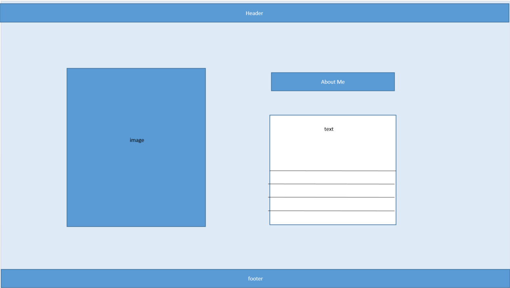

<!-- Capstone Project -->

<!-- Cassandra's Portfolio -->

<!-- About -->

<!-- Built with -->
CodeX Academy
Coursera
Free Code Camp
Canva
GitHub
VS.Code
GitBash
BootStrap
W3Schools
Coding2Go YouTube
Boot Dev YouTube
Bro Code YouTube
FreeCodeCamp YouTube
Programming With Pax YouTube
Great Stack YouTube
HTML
HTML Colors
Styles.CSS
JavaScript.JS
Google Color Palette
Color Kit
GeeksforGeeks
Gemini
Chatgpt
Micorsoft Copilot
Artguru AI
Diffusionart
Wire Frame
Learn Code with Mimo
Code Wars
LeetCode
HackerRank

<!-- Roadmap -->

<!-- Wireframe -->

